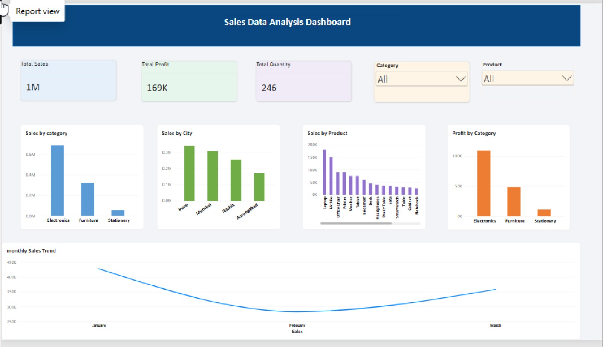

# Sales Data Analysis & Interactive Dashboard

This repository contains a comprehensive **Sales Data Analysis** project that highlights data cleaning, exploratory data analysis (EDA), and interactive data visualization using Python and Power BI.

## 🛠️ Tech Stack & Tools Used
- **Python:** For data cleaning, processing, and transformation.
- **Pandas & NumPy:** For efficient data manipulation and structuring.
- **Matplotlib:** For exploratory data visualizations and trend analysis.
- **Power BI:** Built an interactive dashboard with dynamic slicers and KPI cards.

## 📊 Dashboard Preview

## 📊 Key Highlights & Analysis
- **Data Preprocessing:** Handled missing values, removed duplicate rows, and optimized data formats.
- **Sales & Profit Analysis:** Analyzed sales performance and profit margins grouped by product categories, cities, and monthly timelines.
- **Interactive Dashboard:** Designed user-friendly visuals in Power BI to track key metrics and performance indicators dynamically.

---
*Developed as a B.Tech project to strengthen practical skills in Data Analytics.*
